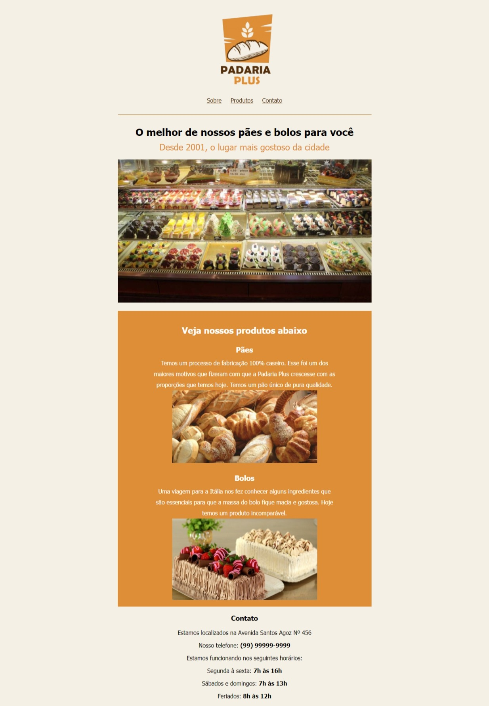

# Projeto Padaria_Plus

## Objetivo:
O projeto é uma página Web para divulgar os produtos da Padaria Plus. Não é uma página responsiva.

---
    

   

## Tecnologia:
  
  

---
## Arquitetura da página web.
### Estrutura de Pasta:

    📁 Projeto-PADARIA_PLUS
    |
    |   📁 css
    |       |- 📑 style.css
    |       |- body
    |       |- .secao
    |       |- .imagem-logotipo
    |       |- a
    |       |- h1
    |       |- h2
    |       |- .imagem-banner
    |       |- .secao-destaque
    |       |- .secao-destaque h3
    |       |- .secao-destaque h4
    |       |- .secao-destaque p
    |       |- .secao-destaque img
    |       |- span
    |   📁 img
    |       |- bolos.jpg
    |       |- contato.png
    |       |- layout1.png
    |       |- logo.png
    |       |- paes.jpg
    |       |- produtos-padaria.jpg
    |       
    |- 📑 index.html
    |   |-  Head
    |       |- meta charset
    |       |- meta description
    |       |- meta
    |       |- link
    |       |- title
    |
    |   |-  body
    |        
    |   |- div ( 1ª seção - Navbar)
    |       |-  img
    |       |-  p
    |       |-  a
    |       |-  a
    |       |-  a
    |
    |   |- div ( 2ª seção -  SOBRE)
    |       |-  h1
    |       |-  h2, span
    |       |-  img
    |
    |   |- div ( 3ª seção - PRODUTOS)
    |       |- h3, span
    |       |- h4
    |       |- p
    |       |- img
    |       |- h4
    |       |- p
    |       |- img
    |
    |   |- div ( 4ª seção - Contato)
    |       |- h3
    |       |- p
    |       |- p, span
    |       |- p  
    |       |- p, span
    |       |- p, span
    |       |- p, span
    

    
---
 

### Layout 
  

---
## Contato  

 
  
  

  

 
 

   

   
   
   

___

                                      Nilva Pires 🔸 Developer FullStack Web & DataScience🔸
                                              🔸 Todos os direitos Reservados 🔸 2023

